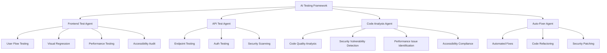

# AI Testing Framework for Fashun.co.in

This framework implements AI-powered testing and debugging agents that work together to automatically test, analyze, and fix issues in the Fashun platform.

## Overview

The framework consists of four main AI agents that work together:

1. **Frontend Test Agent** - Tests user flows and UI interactions
2. **API Test Agent** - Tests backend endpoints and services
3. **Code Analysis Agent** - Analyzes code for issues, vulnerabilities, and improvements
4. **Auto-Fixer Agent** - Automatically applies fixes and refactors code

## Architecture



## Agents

### 1. Frontend Test Agent (`frontend-tester.ts`)

Automatically tests user interactions and journeys:

- Authentication flows (Google, Apple, Anonymous)
- Shopping journey (browsing, cart, checkout)
- Profile features (avatar training, link management)
- Accessibility auditing
- Performance testing
- Visual regression testing

### 2. API Test Agent (`api-tester.ts`)

Tests backend services and endpoints:

- Health checks
- Authentication endpoints
- Product catalog APIs
- Order management APIs
- Profile service APIs
- Security scanning

### 3. Code Analysis Agent (`code-analyzer.ts`)

Analyzes code for issues and improvements:

- Security vulnerabilities detection
- Performance issue identification
- Code smell detection
- Accessibility compliance checking
- Report generation

### 4. Auto-Fixer Agent (`auto-fixer.ts`)

Automatically applies fixes and improvements:

- Security vulnerability patching
- Performance optimizations
- Code refactoring
- Accessibility improvements
- Backup and rollback functionality

## Usage

### Running All Tests

```bash
npm run ai:test
```

### Running Individual Test Suites

```bash
# Run frontend tests
npm run ai:test:frontend

# Run API tests
npm run ai:test:api

# Run code analysis
npm run ai:analyze

# Apply automated fixes
npm run ai:fix
```

### Running the Demo Workflow

```bash
npm run ai:demo
```

## Integration with CI/CD

The AI testing framework can be integrated into your CI/CD pipeline to automatically:

1. Run tests on every commit
2. Analyze code quality
3. Apply automated fixes
4. Generate reports

Example GitHub Actions workflow:

```yaml
name: AI Testing
on: [push, pull_request]
jobs:
  ai-testing:
    runs-on: ubuntu-latest
    steps:
      - uses: actions/checkout@v2
      - name: Setup Node.js
        uses: actions/setup-node@v2
        with:
          node-version: '18'
      - name: Install dependencies
        run: npm install
      - name: Run AI Testing Framework
        run: npm run ai:test
```

## Configuration

The framework can be configured through environment variables:

- `AI_TEST_BASE_URL` - Base URL for API testing (default: http://localhost:3000)
- `AI_TEST_PROJECT_ROOT` - Project root directory (default: current directory)
- `AI_TEST_HEADLESS` - Run browser tests in headless mode (default: true)

## Extending the Framework

### Adding New Test Cases

To add new test cases to the Frontend Test Agent:

1. Add a new method in `frontend-tester.ts`
2. Add the test case to the appropriate test suite method
3. Update the test runner to execute your new test

### Adding New Analysis Rules

To add new analysis rules to the Code Analysis Agent:

1. Add a new method in `code-analyzer.ts`
2. Call your method in the `analyzeFile` method
3. Add appropriate suggestions for any issues found

### Adding New Fix Strategies

To add new fix strategies to the Auto-Fixer Agent:

1. Add a new method in `auto-fixer.ts`
2. Add your fix strategy to the `applyFixes` method
3. Update the refactoring options

## Reports

The framework generates detailed reports for:

- Test results
- Code analysis findings
- Applied fixes
- Performance metrics

Reports are generated in both JSON and human-readable formats.

## Limitations

- Currently uses simulated testing (no real browser/API calls)
- Requires implementation of actual testing logic for production use
- Backup/rollback functionality needs further development
- Integration with external AI services (like Functionize, Tricentis, etc.) not implemented

## Future Enhancements

1. Integration with real browser automation tools (Puppeteer)
2. Integration with accessibility testing tools (axe-core)
3. Integration with performance monitoring tools (Lighthouse)
4. Connection to external AI testing platforms via APIs
5. Machine learning models for self-healing tests
6. Natural language test case generation
7. Advanced code analysis with AI-powered pattern recognition

## Contributing

1. Fork the repository
2. Create a feature branch
3. Make your changes
4. Run the AI testing framework to ensure everything works
5. Submit a pull request

## License

This project is licensed under the MIT License.